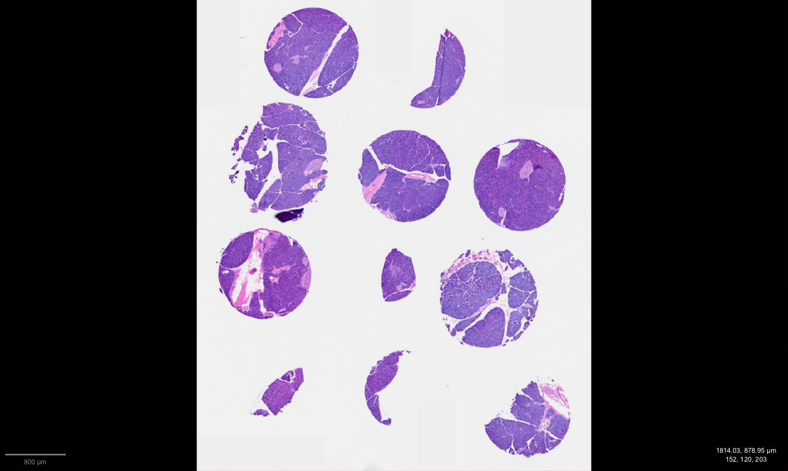
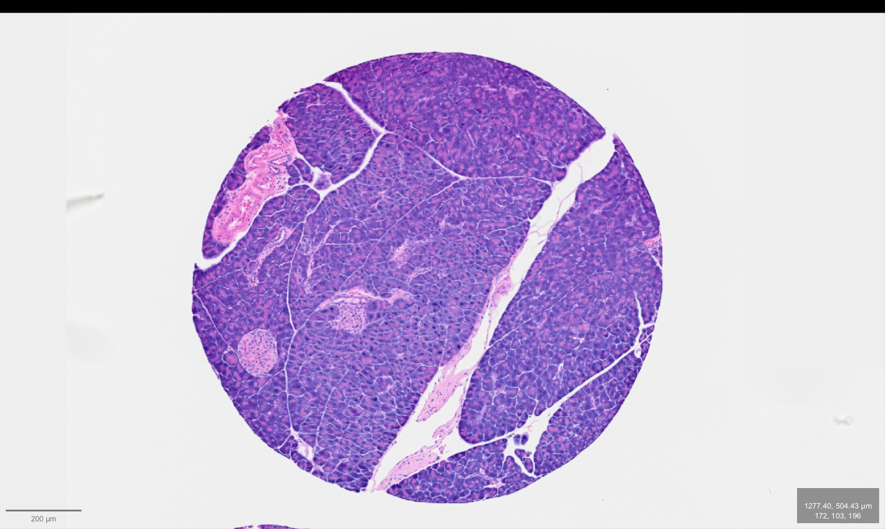
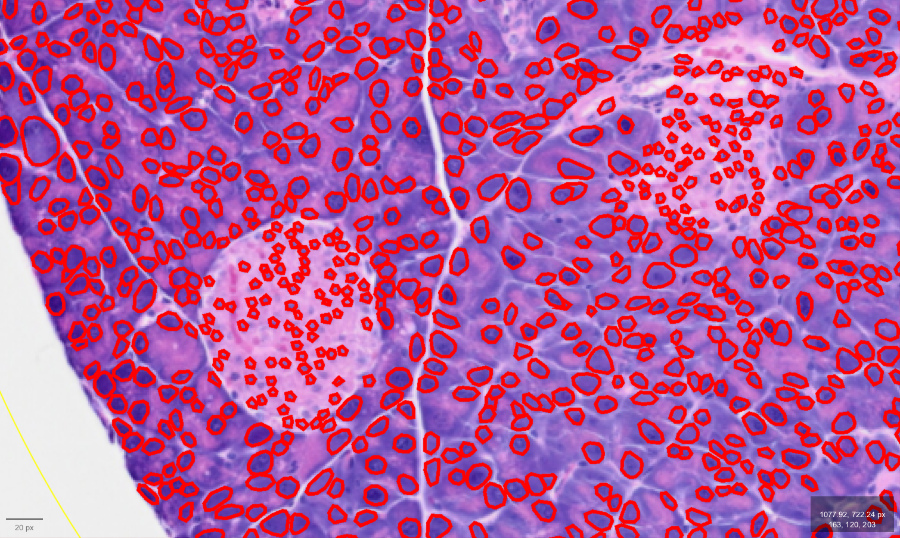
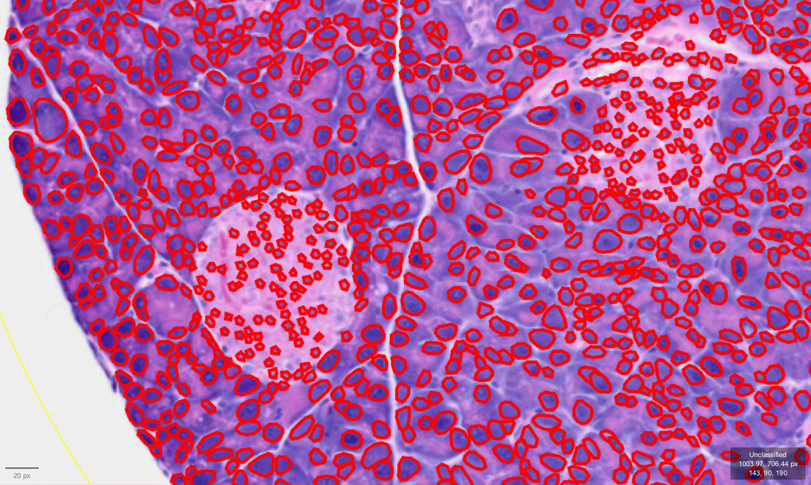
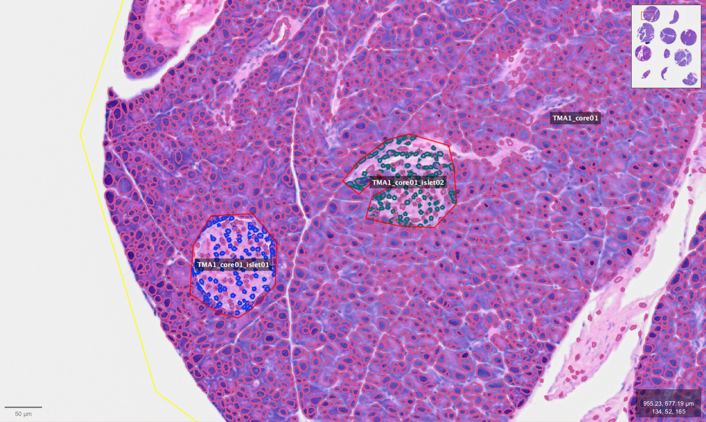

# Visium HD pancreas TMA – H&E nuclear segmentation

This repository documents optimisation of H&E nuclear segmentation for a
Visium HD pancreas TMA dataset using QuPath v0.5.1 and the StarDist2D
`he_heavy_augment.pb` model. The aim is to obtain nuclear segmentations
suitable for near single-cell resolution mapping of Visium HD bins.

---

## 1. TMA overview and selected core

**Figure 1A. Whole Visium HD TMA**

**Figure 1B. Selected pancreas core**

---

## 2. High-magnification region of interest

**Figure 1C. H&E ROI (no segmentation)**

---

## 3. StarDist threshold optimisation (single-pass)

All segmentations in this section use:

- QuPath v0.5.1  
- StarDist2D `he_heavy_augment.pb`  
- Image pixel size: 1.06 µm / pixel  
- StarDist analysis scale: 0.5 µm / pixel  

Only the detection threshold is varied.

**Figure 1D. Initial threshold (`probThreshold = 0.50`)**

**Figure 1E. Optimised threshold (`probThreshold = 0.30`)**

The optimised threshold captures dense, well-separated nuclei across endocrine
and exocrine regions and is used as the basis for subsequent near single-cell
Visium HD analysis.

The full optimisation figure is also available as:

[VisiumSegmentationOptimisation.pdf](VisiumSegmentationOptimisation.pdf)

---

## 4. Two-pass StarDist segmentation with islet-optimised ROIs

To obtain more accurate nuclear counts within endocrine islets while retaining
robust segmentation in surrounding exocrine tissue and ducts, a two-pass
StarDist workflow was implemented in QuPath.

### 4.1. Rationale

- Exocrine/duct nuclei stain strongly and are well segmented with moderately
  conservative StarDist settings.
- Islet nuclei are often paler and more heterogeneous, and benefit from a more
  sensitive configuration (lower detection threshold, relaxed size limits).
- Exact per-islet cell counts are required for downstream Visium HD analysis,
  so islets are handled separately via dedicated ROIs.

### 4.2. Workflow

1. In QuPath, draw one **core annotation** per tissue core  
   (e.g. `TMA1_core01`).
2. Within each core, draw one or more **islet annotations** whose names contain
   the string `islet` (case-insensitive), e.g.:  
   `TMA1_core01_islet01`, `TMA1_core01_islet02`, …
3. Run the two-pass script:

   - **Pass 1 – cores (exocrine + ducts):**
     - Runs StarDist on all non-islet annotations with moderately sensitive
       parameters.
     - Applies size filtering and an optional hematoxylin OD filter to remove
       clear non-nuclear detections.
   - **Pass 2 – islets (endocrine):**
     - Re-runs StarDist only inside islet annotations using a lower probability
       threshold and relaxed size limits to better capture faint and edge
       nuclei.
     - Clears any previous detections in those islet ROIs before re-segmentation.

4. For all nuclei, the script sets the **Classification** to the parent
   annotation name (e.g. `TMA1_core01` or `TMA1_core01_islet02`), enabling
   straightforward per-core and per-islet counts from the exported
   measurements.

### 4.3. Example output

**Figure 2. Two-pass segmentation of a Visium HD pancreas core**

- Yellow outlines: nuclei detected in the core (exocrine + ducts).  
- Blue / green outlines: nuclei detected within islet ROIs using
  islet-optimised StarDist settings.

This configuration provides high-recall islet nuclear segmentation suitable for
per-islet cell counting while maintaining good performance in exocrine tissue.

---

## 5. QuPath StarDist scripts

Two Groovy scripts are included in this repository:

- `H&EAnnotationOptimised.groovy` – single-pass StarDist segmentation for all
  annotations (global “best compromise” settings).
- `H&EAnnotation_isletoptimised.groovy` – two-pass StarDist segmentation with
  different settings for cores vs islets, tuned for accurate per-islet counts.

---

Got it — no fenced code blocks at all, just plain markdown text with parameters spelled out. Here’s a single Section 5 you can copy–paste into the README:

---

## 5. QuPath StarDist scripts

Two Groovy scripts are included in this repository:

* `H&EAnnotationOptimised.groovy` – single-pass StarDist segmentation for all annotations (global “best compromise” settings).
* `H&EAnnotation_isletoptimised.groovy` – two-pass StarDist segmentation with different settings for cores vs islets, tuned for accurate per-islet counts.

---

### 5.1. Single-pass segmentation (`H&EAnnotationOptimised.groovy`)

This script applies one StarDist configuration to all selected parent objects (or all annotations if none are selected). It corresponds to the global, single-pass optimisation described earlier in the README.

**Script:** `H&EAnnotationOptimised.groovy`
**Model:** `he_heavy_augment.pb`
**Software:** QuPath v0.5.1 + StarDist2D extension

**Key parameters**

* `modelPath`: `/Users/alanamullins/Downloads/he_heavy_augment.pb`
* `imagePixelSizeMicrons`: 1.06 µm per pixel (image calibration)
* `stardistPixelSizeMicrons`: 0.5 µm per pixel (StarDist analysis scale)
* `probThreshold`: 0.28 (lower = more nuclei, higher = fewer nuclei)

**Behaviour**

* Overrides the pixel size of the current image to 1.06 µm per pixel for consistent measurements.
* Uses percentile normalisation (1st-99th percentiles) before running the StarDist model.
* Runs StarDist on:

  * all selected annotations, or
  * all annotations if nothing is selected.
* Measures nuclear shape and intensity features.
* Does not apply extra size or intensity filtering after detection.
* Does not distinguish between exocrine and islet regions and does not modify the `PathClass` of detections.

Use this script when a single global nuclear segmentation configuration is sufficient across the whole core and per-islet optimisation is not required.

---

### 5.2. Two-pass islet-optimised segmentation (`H&EAnnotation_isletoptimised.groovy`)

This script implements a two-pass workflow where cores (exocrine tissue and ducts) and islets are segmented separately with distinct StarDist settings. It is used to obtain higher recall in endocrine islets while maintaining good segmentation in surrounding exocrine tissue.

**Script:** `H&EAnnotation_isletoptimised.groovy`
**Model:** `he_heavy_augment.pb`
**Software:** QuPath v0.5.1 + StarDist2D extension

#### General settings

* `modelPath`: `/Users/alanamullins/Downloads/he_heavy_augment.pb`
* `imagePixelSizeMicrons`: 1.06 µm per pixel (image calibration)
* `stardistPixelSizeMicronsCores`: 0.55 µm per pixel (analysis scale for cores)
* `stardistPixelSizeMicronsIslets`: 0.50 µm per pixel (analysis scale for islets, slightly finer)

Annotations are split based on their name:

* Islet annotations: annotation name contains the string `islet` (case-insensitive), e.g. `TMA1_core01_islet01`.
* Core annotations: all other annotations, e.g. `TMA1_core01`.

Existing detections under these annotations are removed before each pass.

#### Pass 1 - cores (exocrine + ducts)

StarDist is first run on all non-islet annotations using moderately sensitive parameters tuned for exocrine and ductal nuclei.

Core-specific parameters:

* `probThresholdCores`: 0.18 (more sensitive than the single-pass setting)
* `minAreaCores`: 6.0 µm² (minimum nuclear area retained)
* `maxAreaCores`: 400.0 µm² (maximum nuclear area retained)
* `minHemaODCores`: 0.06 (optional hematoxylin optical density filter; detections below this are removed)

Behaviour for cores:

* Runs StarDist on all annotations that are not labelled as islets.
* Applies area-based filtering using `minAreaCores` and `maxAreaCores` to remove tiny debris and large merged objects.
* Optionally removes detections with low hematoxylin staining (`minHemaODCores`), helping to clean non-nuclear artefacts in exocrine and ductal regions.

#### Pass 2 - islets (endocrine ROIs)

StarDist is then run again only inside islet annotations, using more sensitive settings to capture pale and edge nuclei. Existing detections in islet annotations from the first pass are cleared before re-segmentation.

Islet-specific parameters:

* `probThresholdIslets`: 0.10 (very low to capture faint or edge islet nuclei)
* `minAreaIslets`: 2.0 µm² (minimum nuclear area retained; allows smaller partial nuclei)
* `maxAreaIslets`: 500.0 µm² (maximum nuclear area retained)
* `minHemaODIslets`: 0.0 (hematoxylin OD filtering disabled for islets)

Behaviour for islets:

* Runs StarDist only on annotations whose name contains `islet`.
* Clears any existing detections within islet annotations, then re-segments nuclei with more sensitive parameters.
* Uses relaxed area thresholds to retain small or partially visible nuclei.
* Leaves hematoxylin OD filtering disabled to avoid discarding pale endocrine nuclei.

#### Classification and downstream counting

For both passes:

* Each detection is assigned a `PathClass` equal to its parent annotation name (e.g. `TMA1_core01` for cores or `TMA1_core01_islet02` for islets).
* Final nucleus counts per pass are printed in the QuPath log.

After running the script, detection measurements can be exported from QuPath and grouped by the `Classification` column to obtain per-core and per-islet nuclear counts suitable for downstream Visium HD spatial transcriptomics analyses.

